# Core on-disk format

## Overview

The EROFS core on-disk format is designed to be **as simple as possible**, since
one of the basic use cases of EROFS is as a drop-in replacement for
[tar](https://pubs.opengroup.org/onlinepubs/007908799/xcu/tar.html) or
[cpio](https://pubs.opengroup.org/onlinepubs/007908799/xcu/cpio.html):



Here are some _design principles_:

 - Data (except for _inline data_) is always block-based, but metadata may not;

 - There are **no centralized inode and directory tables** because they are not
   quite friendly for image incremental updates, metadata flexibility, and
   extensibility.  It's up to users whether inodes or directories are arranged
   one by one or not.

 - I/O amplification out of **extra metadata access** should be as small as
   possible.

There are _only **three** ondisk components to form a full filesystem tree_:
`erofs_super_block`, `erofs_inode_{compact,extended}`, and `erofs_dirent`.
If [extended attribute](https://man7.org/linux/man-pages/man7/xattr.7.html)
support also needs to be considered, the additional components will still be
limited.

Note that only `erofs_super_block` needs to be kept at a fixed offset, as
mentioned below.

(ondisk_superblock)=
## Superblock

EROFS superblock is currently 128 bytes in size, which records various
information about the enclosing filesystem.  The superblock will start at an
absolute offset 1024 bytes, and the first 1024 bytes are unused to allow for
other advanced formats easily based on EROFS filesystem, as well as
the installation of x86 boot sectors and other oddities.

The EROFS superblock is laid out as follows in [`struct erofs_super_block`](https://git.kernel.org/pub/scm/linux/kernel/git/torvalds/linux.git/tree/fs/erofs/erofs_fs.h?h=v6.6#n55):

| Offset | Size   | Name                  | Description                                                                                        |
| ------ | ------ | --------------------- | -------------------------------------------------------------------------------------------------- |
| 0x0    | __le32 | magic                 | Magic signature, 0xE0F5E1E2                                                                        |
| 0x4    | __le32 | checksum              | Superblock checksum                                                                                |
| 0x8    | __le32 | feature_compat        | Compatible feature flags.  The kernel can still read this fs even if it doesn't understand a flag  |
| 0xC    |   __u8 | blkszbits             | Block size is 2{sup}`blkszbits`.  It should be no less than 9 (512-byte block size)                |
| 0xD    |   __u8 | sb_extslots           | The total superblock size is 128 + sb_extslots * 16. It should be 0 for future expansion           |
| 0xE    | __le16 | root_nid              | NID (node number) of the root directory                                                            |
| 0x10   | __le64 | inos                  | Total valid inode count                                                                            |
| 0x18   | __le64 | build_time            | When the filesystem was created, in seconds since the epoch                                        |
| 0x20   | __le32 | build_time_ns         | Nanoseconds component of the above timestamp                                                       |
| 0x24   | __le32 | blocks                | Total block count                                                                                  |
| 0x28   | __le32 | meta_blkaddr          | Start block address of metadata area                                                               |
| 0x2C   | __le32 | xattr_blkaddr         | Start block address of shared xattr area                                                           |
| 0x30   |   __u8 | uuid[16]              | 128-bit UUID for volume                                                                            |
| 0x40   |   __u8 | volume_name[16]       | Filesystem label                                                                                   |
| 0x50   | __le32 | feature_incompat      | Incompatible feature flags. The kernel will refuse to mount if it doesn't understand a flag        |
| 0x54   | __le16 | available_compr_algs  | Bitmap for compression algorithms used in this image (FEATURE_INCOMPAT_COMPR_CFGS is set)          |
| 0x54   | __le16 | lz4_max_distance      | Customized LZ4 window size.  0 means the default value (FEATURE_INCOMPAT_COMPR_CFGS isn't set)     |
| 0x56   | __le16 | extra_devices         | Number of external devices.  0 means no extra device                                               |
| 0x58   | __le16 | devt_slotoff          | (Indicate the start address of the external device table)                                          |
| 0x5A   |   __u8 | dirblkbits            | Directory block size is 2{sup}`blkszbits + dirblkbits`.  Always 0 for now                          |
| 0x5B   |   __u8 | xattr_prefix_count    | Total number of long xattr name prefixes                                                           |
| 0x5C   | __le32 | xattr_prefix_start    | (Indicate the start address of long xattr prefixes)                                                |
| 0x60   | __le64 | packed_nid            | NID of the special packed inode, which is mainly used to keep fragments for now                    |
| 0x68   |   __u8 | xattr_filter_reserved | Always 0 for reserved use                                                                          |
| 0x69   |   __u8 | reserved[23]          | Reserved                                                                                           |

## Inodes

Each valid ondisk inode should be aligned to a fixed inode slot (32-byte)
boundary, which is set to be kept in line with the compact inode size.

Each inode can be directly located using the following formula:
```
	inode absolute offset = meta_blkaddr * block_size + 32 * NID
```

Valid inode sizes are either 32 or 64 bytes, which can be distinguished from
a common field that all inode versions have -- `i_format`:

32-byte compact inodes are defined as
[`struct erofs_inode_compact`](https://git.kernel.org/pub/scm/linux/kernel/git/torvalds/linux.git/tree/fs/erofs/erofs_fs.h?h=v6.6#n156)
as below:

| Offset | Size   | Name           | Description                                                            |
| ------ | ------ | -------------- | ---------------------------------------------------------------------- |
| 0x0    | __le16 | i_format       | Inode format hints (e.g. on-disk inode version, datalayout, etc.)      |
| 0x2    | __le16 | i_xattr_icount | (Indicate the extended attribute metadata size of this inode)          |
| 0x4    | __le16 | i_mode         | File mode                                                              |
| 0x6    | __le16 | i_nlink        | Hard link count                                                        |
| 0x8    | __le32 | i_size         | Inode size in bytes                                                    |
| 0xC    |   __u8 | i_reserved[4]  | Reserved                                                               |
| 0x10   |   __u8 | i_u[4]         | (Up to the specific inode datalayout)                                  |
| 0x14   | __le32 | i_ino          | Inode incremental number, mainly used for 32-bit stat(2) compatibility |
| 0x18   | __le16 | i_uid          | Owner UID                                                              |
| 0x1A   | __le16 | i_gid          | Owner GID                                                              |
| 0x1C   |   __u8 | i_reserved2[4] | Reserved                                                               |

64-byte extended inodes are defined as
[`struct erofs_inode_extended`](https://git.kernel.org/pub/scm/linux/kernel/git/xiang/erofs.git/tree/fs/erofs/erofs_fs.h?h=v6.6#n174)
as below:

| Offset | Size   | Name            | Description                                                                         |
| ------ | ------ | --------------- | ----------------------------------------------------------------------------------- |
| 0x0    | __le16 | i_format        | Inode format hints (e.g. on-disk inode version, datalayout, etc.)                   |
| 0x2    | __le16 | i_xattr_icount  | (Indicate the extended attribute metadata size of this inode)                       |
| 0x4    | __le16 | i_mode          | File mode                                                                           |
| 0x6    |   __u8 | i_reserved[4]   | Reserved                                                                            |
| 0x8    | __le64 | i_size          | Inode size in bytes                                                                 |
| 0x10   |   __u8 | i_u[4]          | (Up to the specific inode datalayout)                                               |
| 0x14   | __le32 | i_ino           | Inode incremental number, mainly used for 32-bit stat(2) compatibility              |
| 0x18   | __le32 | i_uid           | Owner UID                                                                           |
| 0x1C   | __le32 | i_gid           | Owner GID                                                                           |
| 0x20   | __le64 | i_mtime         | Inode timestamps derived from the original `mtime`, in seconds since the UNIX epoch |
| 0x28   | __le32 | i_mtime_nsec    | This provides nanosecond precision                                                  |
| 0x2C   | __le32 | i_nlink         | Hard link count                                                                     |
| 0x30   |   __u8 | i_reserved2[16] | Reserved                                                                            |

`inode.i_format` contains format hints for each inode as below:

|   | Bits | Description                                                  |
| - | ---- | ------------------------------------------------------------ |
| 0 |    1 | Inode version (0 - compact; 1 - extended)                    |
| 1 |    3 | Inode data layout (0-4 are valid; 5-7 are reserved for now)  |

## Inode data layouts

There are **five** valid data layouts in total for each inode to indicate how
inode data is recorded on disk.  Only **three** values are taken into account in
the EROFS core on-disk format:

 - `EROFS_INODE_FLAT_PLAIN (0)`:

   The consecutive physical blocks contain the entirety of the inode's content
with the starting block address stored in `inode.i_u`.

 - `EROFS_INODE_FLAT_INLINE (2)`:

   Except for the tail data block, all consecutive physical blocks hold the
entire content of the inode with the starting block address stored in
`inode.i_u`.  The tail block is kept within the block immediately following the
on-disk inode metadata.

 - `EROFS_INODE_CHUNK_BASED (4)`:

   The entire inode is split into several fixed-size chunks.  Each chunk has
consecutive physical blocks.

## Directories

All ondisk directories are now organized in the form of `directory blocks`.

Each directory block is split into two variable-size parts (`directory entries`
and `filenames`) in order to make random lookups work. All directory entries
(including `.` and `..` ) are _strictly_ recorded in alphabetical order to
enable the improved prefix binary search algorithm.

Each directory entry is defined as 12-byte
[`struct erofs_dirent`](https://git.kernel.org/pub/scm/linux/kernel/git/xiang/erofs.git/tree/fs/erofs/erofs_fs.h?h=v6.6#n276):

| Offset | Size   | Name           | Description                                                                                                    |
| ------ | ------ | -------------- | -------------------------------------------------------------------------------------------------------------- |
| 0x0    | __le64 | nid            | Node number of the inode that this directory entry points to                                                   |
| 0x8    | __le16 | nameoff        | Start offset of the file name in this directory block                                                          |
| 0xA    |   __u8 | file_type      | [File type code](https://git.kernel.org/pub/scm/linux/kernel/git/torvalds/linux.git/tree/fs/fs_types.c?h=v6.6) |
| 0xB    |   __u8 | reserved       | Reserved                                                                                                       |

Note that _nameoff{sub}`0`_ (`nameoff` of the 1st directory entry) also
indicates the total number of directory entries in this directory block.

:::{note}

Other alternative forms (e.g., `Eytzinger order`) were also considered (that is
why we once had [.*_classic](https://git.kernel.org/pub/scm/linux/kernel/git/torvalds/linux.git/tree/fs/erofs/namei.c?h=v5.4#n90)
naming). Here are some reasons that those forms weren't supported:

 - Filenames are variable-sized strings, which makes `Eytzinger order` harder
to be utilized unless `namehash` is also introduced, but it also complicates
the overall implementation and expands the directory sizes;

 - Also, it makes it harder to keep filenames and directory entries in the same
directory block (especially _large directories_) to minimize I/O amplification;

 - readdir(3) will be impacted too if we'd like to keep alphabetical order
strictly.

If there are some better ideas to resolve these, the ondisk definition could be
updated in the future.

:::
