# 📝 Technical Design

The following sections are a summarized technical description for reference if
you are a user or developer interested in EROFS internals. There
is also a paper available, [EROFS: A Compression-friendly
Readonly File System for Resource-scarce Devices](https://www.usenix.org/conference/atc19/presentation/gao).
The details defined in the paper are slightly outdated but the overall ideas are
nearly the same.

## Block-aligned vs unaligned

EROFS data is all arranged in **fixed-size blocks** (aka. block-aligned,
typically 4 KiB) like many modern disk filesystems (e.g. ext4, xfs, btrfs, f2fs,
etc.) to match the intrinsic characteristics of [block devices](https://en.wikipedia.org/wiki/Block_\(data_storage\)).
This means the corresponding data can be *directly* parsed if you read a single
filesystem block for __non-encoded data__ or (possibly) multiple consecutive blocks
(called a single physical cluster) for __encoded data__, which is different
from _archive formats or unaligned filesystems_ (e.g. `cramfs`, `romfs`, `squashfs`,
`affs`, and possibly more FUSE-based implementations.)



The main benefits of using fixed-size blocks are:

 - Block-aligned non-encoded EROFS data can be directly loaded into kernel page
   cache and memory-mapped into user space **without any extra post-processing**.
   Direct I/O and FSDAX can also be used for block-aligned non-encoded EROFS
   data.

 - Block-aligned encoded EROFS data I/O can be **fully utilized**, which means
   there is no unusable encoded byte in each single I/O request. Unlike other
   unaligned approaches, EROFS does not have to cache such
   unusable encoded bytes for later decoding (or never used) for better
   performance (otherwise I/O efficiency for small random I/Os is low due to
   undecodable encoded bytes), which is considered harmful due to utilizing a
   larger memory footprint than necessary.

 - Alternatively, if the encoded blocks are not utilized immediately
   (esp. very little decoded data is requested), the
   encoded blocks could still be _cached in the page cache for later use_.
   This is quite useful on memory-limited devices since _caching compressed data
   is generally more efficient than decompressed data if selected compression
   algorithms is **fast** enough_ (considering main benefits of ZSWAP or ZRAM).
   Although unaligned solutions could also cache encoded data in page cache,
   reclaiming could lead to lower cache pages utilization due to fragmentation
   since page cache reclaims data in pages instead of bytes.

 - Because of this, block-aligned encoded EROFS makes **compressed data cached
   independently**, which means a single physical cluster could be cached
   without coupling with other compression units. In other words, unlike
   unaligned solutions, it is more flexible for EROFS to only cache the necessary
   physical clusters.



(compression_dedupe)=

## Block-aligned fitblk compression

In addition to block-aligned data, unlike EXT4, XFS, BTRFS, F2FS, etc., EROFS
mainly uses a **fixed-size output compression** approach to increase encoded
block utilization and maximize compression ratios.

Such compression approach is not required. However, without this approach,
the final blocks of physical clusters will not be fully filled with encoded
data. Currently LZ4, LZMA (Linux 5.15+), DEFLATE (Linux 6.6+), and Zstandard
(Linux 6.10+) algorithms natively support this mode.

Fixed-size output compression generally has better compression ratios, especially
on small physical clusters (e.g. 4 or 8 KiB) with about 5% additional space saved.

Note that **small compressed physical clusters** are quite important to
end-to-end performance for memory-intensive workloads (that is exactly the EROFS
main target case) since it's quite hard to fully cache either (de)compressed
data in memory on such extreme workloads. In other words, reloading can happen
frequently due to cache misses on these workloads.

## Data deduplication

EROFS supports both _fixed-size chunk deduplication_ and _compressed data
deduplication_:

 - For non-encoded files, data can be split into fixed-size chunks for
   mmap-I/O friendly and only keep chunks with different contents on disk.

 - For encoded files, each physical cluster can be used in a similar way for
   multiple reference. Note that cut points will be adjusted using the
   [Rabin–Karp algorithm](https://en.wikipedia.org/wiki/Rabin%E2%80%93Karp_algorithm)
   in order to improve deduplication (decrease likelihood of unique blocks).



## In short: how is EROFS designed for performance?

A summary of our overall design is listed below:

 - Block-aligned data - no additional I/O waste;

 - Fixed-size output compression - better compression ratios and
   efficient I/O utilization;

 - Independent cache or in-place I/O strategies - to minimize memory footprints;

 - In-place decompression - avoid bounced compressed buffers and poisoned
   cache lines as much as possible;

 - Multi-reference compressed clusters - avoid deduplicated data I/O (where
   possible) and minimize images even further.

:::{note}

EROFS does not prefetch unnecessary on-disk data or amplify user I/O at runtime,
unlike some alternative approaches, which degrades random I/O performance and
increases memory footprint. Those customized strategies can also be achieved by
using [posix_fadvise()](https://pubs.opengroup.org/onlinepubs/000095399/functions/posix_fadvise.html)
or user space tools like `ureadahead`, so there is no need to bother the kernel.

:::

```{toctree}
:hidden:
core_ondisk.md
merging.md
```
