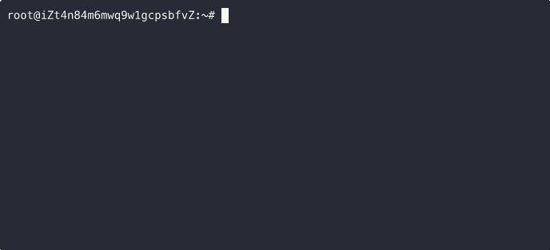

# Image filesystem

Container technologies like cgroups and namespaces offer strong isolation and
portability.  When applications are manually maintained, they can still end up
with outdated dependencies or inconsistent configurations.  This inconsistency
demands constant monitoring and manual intervention, which quickly becomes
unmanageable at scale.

Therefore, the industry consensus for addressing this is to introduce immutable
infrastructure: just like the famous Docker slogan ["Build once, run anywhere"](https://www.docker.com/#:~:text=Build%20once%2C%20run%20anywhere),
immutable images make every container consistent with each other, providing
strong reliability and reducing deployment failures.  In addition, since every
new deployment starts from a clean, verified state, it's much easier to audit
and scale, which improves security and scalability. That's why container images
have become so popular today, in the cloud-native and AI eras.

## Layering

Since containers are isolated, lightweight silos for running applications on
the host operating system, it makes sense to keep those immutable container
images lightweight as well.

One way to achieve this is through deduplication across images.  Today,
Docker/OCI container images are composed of layers to support incremental
builds, enabling files in shared layers to be reused across different images.

The key technology enabling layering is called `snapshotting`.  To share layers
among various physical nodes, snapshots should be distributable easily too.
Currently, there are three main approaches to snapshotting:

 1. The classic VM disk image approach;

 2. Using an existing copy-on-write filesystem that supports snapshots, such as
BTRFS or ZFS;

 3. Using a dedicated package format or an effective image filesystem.

The following subsection explores these approaches in more detail.

## Why not VM disk images or CoW filesystems?

You may expect it is all about the image filesystem as the title suggests,
but why do we use an image filesystem instead of distributing VM disk images
or simply using mature filesystem snapshotting to manage container images?

First of all, an answer like "tar.gz is the de facto standard and it uses the
tar package format, so we'd better use a filesystem to overcome all the
shortcomings of the tar format" is not helpful because it relies on historical
precedent and does not address any key point.

Here are two main reasons:

### Containerization requires a precise, auditable format

Indeed, the classic VM disk image approaches can also be used for container
images, and disk snapshot formats like Qcow2 can be used in order to support
layering.  They do address
[the main issues of tar](https://www.cyphar.com/blog/post/20190121-ociv2-images-i-tar)
because they add another level of abstraction for layering support and expect
existing black-box kernel filesystems to resolve the remaining pain points.
However, the main concern with those approaches is the lack of precision: any
format can be included as long as some component (e.g., the host kernel) can
handle it.

Unlike virtualization, which provides very strong isolation, containerization
typically shares a single kernel, requiring greater cooperation and trust.  As a
result, any data from a remote source could become a vulnerability for the
entire system.  That means container images must be safe for both virtualization
and containerization.  In other words, every user must know exactly what is
inside the container image, making the classic VM disk image approaches insecure
if an unknown filesystem format is mounted by the host kernel and a precise
white-box format definition essential for auditing and scanning to find security
vulnerabilities.

### Generic filesystems pose consistency and stability risks

Generic filesystems can serve as precise, white-box formats for container
images.  However, they are still vulnerable when used as remote images due to
unavoidable metadata inconsistencies.

For example, the allocation status of a physical block may be recorded in
multiple places: the allocation tree (or bitmap), inode extents, and may also
appear in a reverse mapping tree.  When an image is fetched from an untrusted
remote source, an attacker can craft inconsistencies and the resulting bugs are
serious and hard to prevent.

Performing extra consistency checks, either at runtime or beforehand with a tool
like `fsck(8)`, incurs heavy performance penalties.  These risks will then be
amplified by the complexity of kernel filesystem implementations, posing
additional threats to the hosts.

::: {note}
For example, the following crafted EXT4 image can immediately crash all Linux
kernel versions, since it uses
[an expected by-design behavior in EXT4](https://lore.kernel.org/r/20160331165125.GF6207@thunk.org):



It does not cause any obscure metadata inconsistency; it just corrupts the root
inode and sets [`s_errors(EXT4_ERRORS_PANIC)`](https://docs.kernel.org/filesystems/ext4/super.html#super-errors:~:text=__le16-,s_errors)
using the following `debugfs` commands:

```sh
debugfs: set_super_value errors 3
debugfs: sif <2> bmap[0] 0
```

In addition, there are known [EXT4 syzkaller bugs](http://syzkaller.appspot.com/upstream/s/ext4)
that could be exploited (51 open bugs as of 12/03/2025), making mounting
untrusted remote EXT4 filesystems on the host absolutely unsafe.

**Disclaimer:** This paragraph is only used to explain technical details.  Any
further harmful exploits have no relationship with the EROFS project.
:::

The best way to resolve this is read/write separation at the filesystem level:
distribute remote images in a reliable, read-only package format to prevent
any serious inconsistencies, and then prepare the writable layer by reusing
a trusted generic filesystem or generating a new filesystem locally.

## The solution

EROFS is designed as a simple, flexible immutable filesystem format similar to
previous archive formats such as tar, zip, and cpio as well as the CD-ROM
filesystems with the following advanced highlights:

 - Since it's just like an advanced archive format, its metadata cannot become
   severely inconsistent, and the kernel implementation should be able to bear
   any on-disk corruption by design;

 - Data is strictly aligned on disk for extreme performance, and it enables
   other possibilities, such as FSDAX and global data deduplication, from the
   storage stack perspective (e.g., filesystem reflinks and disk deduplication,
   which are difficult with unaligned archive formats);

 - It implements built-in compression, deduplication, and native layering
   features, which can be helpful for containerization;

 - It supports native kernel file-backed mounts, so EROFS images can be mounted
   on Linux natively without loopback block devices;

 - Like common archive formats, EROFS images can be distributed as golden data
   and stored on any filesystem.  Depending on user requirements or specific
   workloads, the writable layer can also be freely configured with any
   filesystem using OverlayFS instead of relying on remote data.

Due to its flexibility and simplicity, it is well-suited for use in container
images and sandbox templates among runc and VM-based containers, making it
easier for end users to audit and scan for vulnerabilities in the images and
reduce potential risks.

## Use Cases (Alphabetical)

1. [Composefs](https://www.cncf.io/projects/composefs)

2. [Containerd EROFS snapshotter](https://github.com/containerd/containerd/blob/main/docs/snapshotters/erofs.md)

3. [Dragonfly Nydus](https://github.com/dragonflyoss/nydus?tab=readme-ov-file#run-nydus-with-in-kernel-erofs-filesystem)
