# 🔎 Overview

```{rubric} EROFS - Enhanced Read-Only File System
```

A modern, flexible, general-purpose, high-performance block-based immutable
filesystem with highly-optimized ondisk format and runtime implementation aimed
at various use cases instead of just focusing on storage space saving without
considering any side effects of runtime performance.

[EROFS](https://docs.kernel.org/filesystems/erofs.html) has been formally
available since Linux 5.4.  It is currently maintained by an open-source
community from all over the world, and is still
[under active development](roadmap.md).

````{div} sd-d-flex-row
```{button-ref} quickstart
:ref-type: doc
:color: primary
:class: sd-rounded-pill sd-mr-3

Get Started
```

```{button-ref} faq
:ref-type: doc
:color: secondary
:class: sd-rounded-pill

FAQ
```
````

---

::::{grid} 1 2 2 3
:gutter: 1 1 1 2

:::{grid-item-card} {octicon}`light-bulb;1.5em;sd-mr-1` Advanced designs
:link: design
:link-type: doc

A modern filesystem more than just another archive format: EROFS is _strictly_
block-aligned to maximize the data utilization of a single disk I/O and enable
advanced features like Direct I/O and FSDAX.

+++
[Learn more »](design)
:::

:::{grid-item-card} {octicon}`gear;1.5em;sd-mr-1` Highly configurable
:link: features
:link-type: doc

Minimal core ondisk format for non-encoded use cases. \
Besides, advanced ondisk and/or runtime features can be enabled on demand.

+++
[Learn more »](features)
:::

:::{grid-item-card} {octicon}`file-zip;1.5em;sd-mr-1` Compression & Deduplication
:link: compression_dedupe
:link-type: ref

Per-file data compression as an option, normally using fixed-sized output
compression to fill up each block.  Compressed data can be deduplicated with
byte-granularity cut points.

+++
[Learn more »](compression_dedupe)
:::

::::

---

```{rubric} Applications
```

 - {octicon}`device-mobile;1em` [The Android system firmware](https://source.android.com/docs/core/architecture/kernel/erofs)

 - {octicon}`container;1em` [Composefs](https://github.com/containers/composefs);
[Dragonfly Nydus](https://nydus.dev/); [gVisor](https://github.com/google/gvisor/pull/9486);
[Kata Containers](https://github.com/kata-containers/kata-containers/blob/main/docs/how-to/how-to-use-erofs-build-rootfs.md)

 - {octicon}`device-desktop` [Archiso](https://gitlab.archlinux.org/archlinux/archiso/-/merge_requests/82);
[dracut-ng](https://github.com/dracut-ng/dracut-ng/pull/546); [kdump-utils](https://github.com/rhkdump/kdump-utils/pull/33);
[Linglong](https://linglong.dev)

 - Distributions: [Alpine Linux](https://pkgs.alpinelinux.org/package/edge/community/x86_64/erofs-utils);
[Arch Linux](https://archlinux.org/packages/extra/x86_64/erofs-utils);
[Azure Linux](https://github.com/microsoft/azurelinux/pull/9971);
[Bottlerocket](https://github.com/bottlerocket-os/twoliter/pull/379);
[Buildroot](https://buildroot.org);
[CentOS Stream](https://gitlab.com/redhat/centos-stream/src/kernel/centos-stream-9/-/commit/37d0627c30a55e4159f00af2d02b5d64b1dc98e8);
[Chromium OS](https://chromium-review.googlesource.com/c/chromiumos/platform/crosutils/+/5125177);
[Debian](https://packages.debian.org/sid/erofs-utils);
[Deepin Linux](https://github.com/deepin-community/erofs-utils);
[Fedora](https://packages.fedoraproject.org/pkgs/erofs-utils/erofs-utils);
[Gentoo](https://packages.gentoo.org/packages/sys-fs/erofs-utils);
[GNU Guix](https://packages.guix.gnu.org/packages/erofs-utils);
[Homebrew](https://formulae.brew.sh/formula/erofs-utils);
[NixOS](https://github.com/NixOS/nixpkgs/tree/nixos-unstable/pkgs/tools/filesystems/erofs-utils);
[openAnolis](https://openanolis.cn/?lang=en);
[OpenCloudOS](https://gitee.com/OpenCloudOS/OpenCloudOS-Kernel/commit/65fdb18aed207b763076b4014139a57662d999c5);
[openEuler](https://gitee.com/openeuler/kernel/pulls/3828);
[openSUSE](https://packagehub.suse.com/packages/erofs-utils);
[Ubuntu](https://packages.ubuntu.com/erofs-utils);
[Red Hat Enterprise Linux](https://access.redhat.com/articles/7084858);
[Void Linux](https://github.com/void-linux/void-packages/tree/master/srcpkgs/erofs-utils);
[yocto](https://yoctoproject.org); and maybe [more](https://repology.org/project/erofs-utils).

 - Bootloaders: [Das U-Boot](https://source.denx.de/u-boot/u-boot/-/tree/master/fs/erofs);
[GNU GRUB](https://git.savannah.gnu.org/cgit/grub.git/tree/grub-core/fs/erofs.c)

```{rubric} Architecture
```



```{rubric} Feedback & Contributing
```

If you're interested, feel free to send feedback and/or patches to
the linux-erofs mailing list <[linux-erofs@lists.ozlabs.org](mailto:linux-erofs@lists.ozlabs.org)>.
[_Developer guides_](developers.md) might be a useful start for newcomers as
the first step.

Please also take a look at [Code of Conduct](https://www.kernel.org/code-of-conduct.html)
for all Linux kernel development communities.

```{rubric} Additional resources
```

[EROFS in-tree documentation](https://www.kernel.org/doc/Documentation/filesystems/erofs.rst) - kernel.org

[An introduction to EROFS](https://lwn.net/Articles/934047/) - LWN.net

[EROFS: A Compression-friendly Readonly File System for Resource-scarce Devices](https://www.usenix.org/conference/atc19/presentation/gao) - USENIX ATC'19.

[EROFS的介绍与讨论](https://mp.weixin.qq.com/s/0_5JnSvfu2pm0CZjBHx8yw) (chn) - Weixin Official Accounts Platform

[EROFS Everywhere: An Image-Based Kernel Approach for Various Use Cases](https://youtu.be/nyfECa7OOUM) (chn) with [slides](https://static.sched.com/hosted_files/kccncosschn2023/13/OSS-China-2023-EROFS.pdf) (eng) - [KubeCon + CloudNativeCon + Open Source Summit China 2023](https://www.lfasiallc.com/kubecon-cloudnativecon-open-source-summit-china/)

[Finding the Best Block Filesystem for Your Embedded Linux System](https://youtu.be/kLxM4FyiVpQ) - Michael Opdenacker, Bootlin @ EOSS 2023

```{toctree}
:hidden:
quickstart.md
design.md
features.md
casestudies.md
roadmap.md
developers.md
faq.md
credits.md
```
