# Core On-disk Format

## Overview

The EROFS core on-disk format is designed to be **as simple as possible**, since
one of the basic use cases of EROFS is as a drop-in replacement for
[tar](https://pubs.opengroup.org/onlinepubs/007908799/xcu/tar.html) or
[cpio](https://pubs.opengroup.org/onlinepubs/007908799/xcu/cpio.html):



The format design principles are as follows:

 - Data (except for _inline data_) is always block-based; metadata is not strictly block-based.

 - There are **no centralized inode or directory tables**. These are not
   suitable for image incremental updates, metadata flexibility, and
   extensibility. It is up to users to determine whether inodes or directories
   are arranged one by one or not.

 - I/O amplification from **extra metadata access** should be as small as
   possible.

There are _only **three** on-disk components to form a full filesystem tree_:
superblock, inodes, and directory entries.

Note that only the superblock needs to be kept at a fixed offset, as mentioned below.

### Conformance to Core Format

An EROFS image conforms to the core on-disk format if and only if **all** of the
following conditions are met:

1. The `is_compressed` field (offset 0x54, 2 bytes) in the superblock is **0**.
2. All bits in `feature_compat` and `feature_incompat`, except those listed in
   the [Feature Flags](#feature-flags) section below, are **0**.

An image that does not meet these conditions uses one or more optional features
described in separate feature-specific documents.

(on_disk_superblock)=
## Superblock

The EROFS superblock is located at a fixed absolute offset of **1024 bytes**.
Its base size is 128 bytes. When `sb_extslots` is non-zero, the total superblock
size is `128 + sb_extslots * 16` bytes. The first 1024 bytes are currently unused,
which allows for support of other advanced formats based on EROFS, as well as
the installation of x86 boot sectors and other oddities.

### Field Definitions

| Offset | Size | Type   | Name                     | Description |
|--------|------|--------|--------------------------|-------------|
| 0x00   | 4    | `u32`  | `magic`                  | Magic signature: `0xE0F5E1E2` |
| 0x04   | 4    | `u32`  | `checksum`               | CRC32-C checksum of the superblock block; see {ref}`superblock-checksum` |
| 0x08   | 4    | `u32`  | `feature_compat`         | Compatible feature flags; see {ref}`feature-flags` |
| 0x0C   | 1    | `u8`   | `blkszbits`              | Block size = `2^blkszbits`; minimum 9 |
| 0x0D   | 1    | `u8`   | `sb_extslots`            | Number of 16-byte superblock extension slots |
| 0x0E   | 2    | `u16`  | `rootnid`                | Root directory NID |
| 0x10   | 8    | `u64`  | `inos`                   | Total valid inode count |
| 0x18   | 8    | `u64`  | `build_time`             | Filesystem creation time, seconds since UNIX epoch |
| 0x20   | 4    | `u32`  | `build_time_nsec`        | Nanoseconds component of `build_time` |
| 0x24   | 4    | `u32`  | `blocks`                 | Total filesystem block count |
| 0x28   | 4    | `u32`  | `meta_blkaddr`           | Start block address of the metadata area |
| 0x2C   | 4    | `u32`  | `reserved`               | Feature-specific; not described in core format |
| 0x30   | 16   | `u8[]` | `uuid`                   | 128-bit UUID for the volume |
| 0x40   | 16   | `u8[]` | `volume_name`            | Filesystem label (not null-terminated if 16 bytes) |
| 0x50   | 4    | `u32`  | `feature_incompat`       | Incompatible feature flags; see {ref}`feature-flags` |
| 0x54   | 2    | `u16`  | `is_compressed`          | 0 for non-compressed images, any non-zero value for compressed images |
| 0x56   | 4    | `u32`  | `reserved`               | Feature-specific; not described in core format |
| 0x5A   | 1    | `u8`   | `dirblkbits`             | Directory block size = `2^(blkszbits + dirblkbits)`; currently always 0 |
| 0x5B   | 37   | `u8[]` | `reserved`               | Feature-specific; not described in core format |

### Magic Number

The magic number at offset 0x00 must be `0xE0F5E1E2` (little-endian). A reader must
reject any image whose first four bytes at offset 1024 do not match this value.

(superblock-checksum)=
### Superblock Checksum

When `EROFS_FEATURE_COMPAT_SB_CHKSUM` is set, the `checksum` field contains a
CRC32-C digest. The digest is computed over the byte range `[1024, 1024 + block_size)`,
with the four bytes of the `checksum` field itself treated as zero during computation.

> For example, when `blkszbits` is 12 (block size is 4 KiB):
>
> | Offset | Size | Description                                    | Checksum covered |
> |--------|------|------------------------------------------------|------------------|
> | 0      | 1024 | Padding                                        | No               |
> | 1024   | 4    | Magic number                                   | Yes              |
> | 1028   | 4    | Checksum field in superblock, filled with zero | Yes              |
> | 1032   | 3064 | Remaining bytes in the filesystem block        | Yes              |

> **Tip:** Some implementations (e.g., `java.util.zip.CRC32C`) apply a final
> bit-wise inversion. If the superblock checksum does not match, try inverting it.

(feature-flags)=
### Feature Flags

#### `feature_compat` — Compatible Feature Flags

A mount implementation that does not recognise a bit in `feature_compat` may still
mount the filesystem without loss of correctness.

| Bit mask     | Name                                        | Description |
|--------------|---------------------------------------------|-------------|
| `0x00000001` | `EROFS_FEATURE_COMPAT_SB_CHKSUM`            | Superblock CRC32-C checksum is present; see {ref}`superblock-checksum` |
| `0x00000002` | `EROFS_FEATURE_COMPAT_MTIME`                | Per-inode mtime is stored in extended inodes |

#### `feature_incompat` — Incompatible Feature Flags

A mount implementation that does not recognise any bit in `feature_incompat` must
refuse to mount the filesystem.

The core on-disk format defines no incompatible feature flags. A non-zero
`feature_incompat` value indicates one or more optional extensions.

(on_disk_inodes)=
## Inodes

Each on-disk inode must be aligned to a **32-byte inode slot** boundary, which is
set to be kept in line with the compact inode size. Given a NID `nid`, its inode can
be located in O(1) time by computing the absolute byte offset as follows:

```
inode_offset = meta_blkaddr * block_size + 32 * nid
```

The NIDs for the root directory and special-purpose inodes are stored in the
superblock. Valid inode sizes are either **32 bytes** (compact) or **64 bytes**
(extended), distinguished by bit 0 of the `i_format` field.

### Compact Inode (32 bytes)

Defined as [`struct erofs_inode_compact`](https://git.kernel.org/pub/scm/linux/kernel/git/torvalds/linux.git/tree/fs/erofs/erofs_fs.h):

| Offset | Size | Type  | Name             | Description |
|--------|------|-------|------------------|-------------|
| 0x00   | 2    | `u16` | `i_format`       | Inode format hints; see {ref}`i_format-field` |
| 0x02   | 2    | `u16` | `reserved`       | Feature-specific; not described in core format |
| 0x04   | 2    | `u16` | `i_mode`         | File type and permission bits |
| 0x06   | 2    | `u16` | `i_nb`           | Union; see {ref}`i_nb-union` |
| 0x08   | 4    | `u32` | `i_size`         | File size in bytes (32-bit) |
| 0x0C   | 4    | `u32` | `reserved`       | Feature-specific; not described in core format |
| 0x10   | 4    | `u32` | `i_u`            | Union; see {ref}`i_u-union` |
| 0x14   | 4    | `u32` | `i_ino`          | Inode serial number for 32-bit `stat(2)` compatibility |
| 0x18   | 2    | `u16` | `i_uid`          | Owner UID (16-bit) |
| 0x1A   | 2    | `u16` | `i_gid`          | Owner GID (16-bit) |
| 0x1C   | 4    | `u32` | `i_reserved`     | Reserved; must be 0 |

### Extended Inode (64 bytes)

Defined as [`struct erofs_inode_extended`](https://git.kernel.org/pub/scm/linux/kernel/git/torvalds/linux.git/tree/fs/erofs/erofs_fs.h):

| Offset | Size | Type   | Name              | Description |
|--------|------|--------|-------------------|-------------|
| 0x00   | 2    | `u16`  | `i_format`        | Inode format hints; see {ref}`i_format-field` |
| 0x02   | 2    | `u16`  | `reserved`        | Feature-specific; not described in core format |
| 0x04   | 2    | `u16`  | `i_mode`          | File type and permission bits |
| 0x06   | 2    | `u16`  | `i_nb`            | Union; see {ref}`i_nb-union` |
| 0x08   | 8    | `u64`  | `i_size`          | File size in bytes (64-bit) |
| 0x10   | 4    | `u32`  | `i_u`             | Union; see {ref}`i_u-union` |
| 0x14   | 4    | `u32`  | `i_ino`           | Inode serial number for 32-bit `stat(2)` compatibility |
| 0x18   | 4    | `u32`  | `i_uid`           | Owner UID (32-bit) |
| 0x1C   | 4    | `u32`  | `i_gid`           | Owner GID (32-bit) |
| 0x20   | 8    | `u64`  | `i_mtime`         | Modification time, seconds since UNIX epoch |
| 0x28   | 4    | `u32`  | `i_mtime_nsec`    | Nanoseconds component of `i_mtime` |
| 0x2C   | 4    | `u32`  | `i_nlink`         | Hard link count (32-bit) |
| 0x30   | 16   | `u8[]` | `i_reserved2`     | Reserved; must be 0 |

(i_format-field)=
### `i_format` Field

The `i_format` field is present at offset 0x00 in both inode variants and encodes
layout metadata:

| Bits  | Width | Description |
|-------|-------|-------------|
| 0     | 1     | Inode version: 0 = compact (32-byte), 1 = extended (64-byte) |
| 1–3   | 3     | Data layout: values 0–4 are defined; 5–7 are reserved. See {ref}`inode_data_layouts` |
| 4     | 1     | `EROFS_I_NLINK_1_BIT` (non-directory compact inodes) / `EROFS_I_DOT_OMITTED_BIT` (directory inodes) |
| 5–15  | 11    | Reserved; must be 0 |

Bit 4 has two mutually exclusive interpretations:

- **`EROFS_I_NLINK_1_BIT`** (non-directory compact inodes only): when set, the hard
  link count is implicitly 1 and `i_nb.nlink` need not be read, freeing `i_nb` for
  other feature-specific uses.
- **`EROFS_I_DOT_OMITTED_BIT`** (directory inodes only): when set, the `.` entry is
  omitted from the directory's dirent list to save space.

(i_nb-union)=
### `i_nb` Union

The `i_nb` field (2 bytes at offset 0x06) is interpreted based on the data layout
and whether `EROFS_I_NLINK_1_BIT` is set:

| Name               | Applicable when | Description |
|--------------------|-----------------|-------------|
| `i_nb.nlink`       | `EROFS_I_NLINK_1_BIT` unset (non-directory compact inodes) | Hard link count |

Other interpretations of `i_nb` are defined by optional extensions.

(i_u-union)=
### `i_u` Union

The `i_u` field (4 bytes at offset 0x10) is interpreted based on the data layout:

| Name              | Applicable when | Description |
|-------------------|-----------------|-------------|
| `i_u.startblk`    | Flat inodes     | Starting block number |
| `i_u.rdev`        | Character/block device inodes | Device ID |

(inode_data_layouts)=
## Inode Data Layouts

The data layout of an inode is encoded in bits 1–3 of `i_format`. The core format
defines two flat layouts.

### `EROFS_INODE_FLAT_PLAIN` (0)

`i_u` is interpreted as `startblk` (the 32-bit starting block address).

The inode's data lies in consecutive blocks starting from that address,
occupying `ceil(i_size / block_size)` consecutive blocks.

### `EROFS_INODE_FLAT_INLINE` (2)

`i_u` is interpreted as `startblk` (the 32-bit starting block address).

The inode's data lies in consecutive blocks starting from that address, except for the tail part that is inlined in the block immediately following the inode metadata.
If `i_size` is small enough that the entire content fits in the inline tail, there
are no preceding blocks and `i_u` is a don't-care field.

:::{note}
This layout is not allowed if the tail inode data block cannot be inlined.
:::

(on_disk_directories)=
## Directories

All on-disk directories are organized in the form of **directory blocks** of size
`2^(blkszbits + dirblkbits)` (currently `dirblkbits` is always 0).

### Directory Block Structure

Each directory block is divided into two contiguous regions:

1. A fixed-size array of directory entry records at the start of the block.
2. Variable-length filename strings packed at the end of the block, growing towards
   the entry array.

The `nameoff` field of the **first** entry in a block encodes the total number of
directory entries in that block:

```
entry_count = nameoff[0] / sizeof(erofs_dirent)
```

All entries within a directory block, including `.` and `..`, are stored in strict
**lexicographic (byte-value ascending) order** to enable an improved prefix binary
search algorithm.

### Directory Entry Record (12 bytes)

Defined as [`struct erofs_dirent`](https://git.kernel.org/pub/scm/linux/kernel/git/torvalds/linux.git/tree/fs/erofs/erofs_fs.h):

| Offset | Size | Type  | Name        | Description |
|--------|------|-------|-------------|-------------|
| 0x00   | 8    | `u64` | `nid`       | Node number of the target inode |
| 0x08   | 2    | `u16` | `nameoff`   | Byte offset of the filename within this directory block |
| 0x0A   | 1    | `u8`  | `file_type` | File type code (see below) |
| 0x0B   | 1    | `u8`  | `reserved`  | Reserved; must be 0 |

#### `file_type` Values

| Value | Constant            | POSIX type |
|-------|---------------------|------------|
| 0     | `EROFS_FT_UNKNOWN`  | Unknown |
| 1     | `EROFS_FT_REG_FILE` | Regular file |
| 2     | `EROFS_FT_DIR`      | Directory |
| 3     | `EROFS_FT_CHRDEV`   | Character device |
| 4     | `EROFS_FT_BLKDEV`   | Block device |
| 5     | `EROFS_FT_FIFO`     | FIFO |
| 6     | `EROFS_FT_SOCK`     | Socket |
| 7     | `EROFS_FT_SYMLINK`  | Symbolic link |

### Filename Encoding

Filenames are stored as raw byte sequences and are **not** null-terminated. The
length of entry `i` is derived as:

- For all entries except the last: `nameoff[i+1] − nameoff[i]`.
- For the last entry in the block: `block_end − nameoff[last]`, where `block_end`
  is the first byte past the block.

No character encoding is mandated; UTF-8 is recommended.

:::{note}

Other alternative forms (e.g., `Eytzinger order`) were also considered (that is
why there was once [.*_classic](https://git.kernel.org/pub/scm/linux/kernel/git/torvalds/linux.git/tree/fs/erofs/namei.c?h=v5.4#n90)
naming). Here are some reasons those forms were not supported:

  - Filenames are variable-sized strings, which makes `Eytzinger order` harder
    to utilize unless `namehash` is also introduced, but that complicates the
   overall implementation and expands directory sizes.

 - It is harder to keep filenames and directory entries in the same directory
   block (especially _large directories_) to minimize I/O amplification.

 - `readdir(3)` would be impacted too if strict alphabetical order were required.

If there are better ideas to resolve these, the on-disk definition could be updated
in the future.

:::
